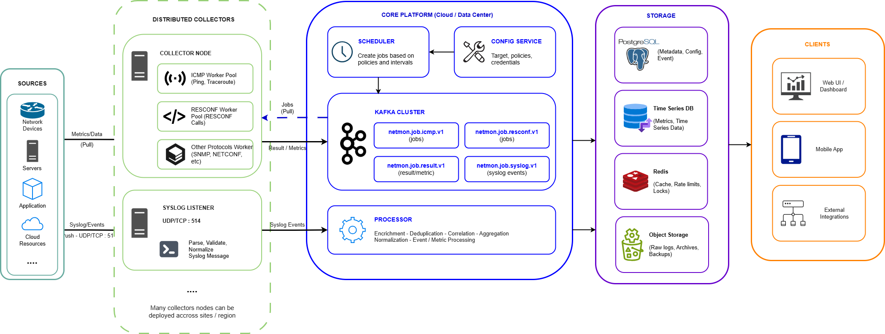

# network-monitoring-system

#### Architecture


## Project Structure

```
network-monitoring-system/
├── api/
│   └── proto/
│       ├── collector.proto       # gRPC definitions for collector registration/heartbeats
│       └── scheduler.proto       # gRPC definitions for job distribution
├── cmd/
│   ├── scheduler/
│   │   └── main.go               # Scheduler entry point
│   └── collector/
│       └── main.go               # Collector entry point
├── internal/
│   ├── scheduler/                # Scheduler logic (job assignment, target registry)
│   ├── collector/                # Core collector engine
│   │   ├── engine.go             # Worker pool management
│   │   ├── icmp.go               # ICMP execution logic
│   │   ├── syslog.go             # Syslog UDP/TCP listener
│   │   └── restconf.go           # RESTCONF/HTTP client
│   ├── model/
│   │   └── event.go              # Unified Normalized Event structs
│   └── storage/                  # Database clients
│       ├── postgres/             # Metadata/Configs
│       ├── redis/                # Rate limiting / caching
│       └── timeseries/           # Prometheus/VictoriaMetrics exporters
├── pkg/                          # Shared utilities (logging, retry helpers)
├── go.mod
└── go.sum
```

---

## Pipeline 1: Pull-Based Polling Flow (ICMP & RESTCONF)

This flow tracks periodic health checks where the system actively queries network infrastructure.

```
[ PostgreSQL ]
       │  (1. Fetch Inventory & Frequencies)
       ▼
 ┌───────────┐  (2. Stream Jobs via gRPC)   ┌─────────────┐
 │ SCHEDULER │ ───────────────────────────> │  COLLECTOR  │
 └───────────┘                              └──────┬──────┘
       ▲                                           │ (3. Read job queue)
       │                                           ▼
       │                                    ┌─────────────┐
       │ (6. gRPC StreamResults)            │ Worker Pool │
       │                                    └──────┬──────┘
       │                                           │ (4. Execute concurrent I/O)
       │                                           ▼
       │                                    ┌─────────────┐
       └─────────────────────────────────── │ Target Node │
                                            └─────────────┘
```

### Steps

1. Scheduler queries PostgreSQL for devices and polling intervals  
2. Sends jobs via gRPC (`StreamJobs`)  
3. Collector pushes jobs into `jobQueue`  
4. Worker pool executes with timeout + rate limiting  
5. Performs ICMP / RESTCONF calls  
6. Sends `UnifiedEvent` back via `StreamResults`  

---

## Pipeline 2: Push-Based Streaming Flow (Syslog)

This flow handles spontaneous events generated directly by network devices.

```
 ┌─────────────┐  (1. UDP Packet on Port 514)  ┌─────────────┐
 │ Target Node │ ────────────────────────────> │  COLLECTOR  │
 └─────────────┘                               └──────┬──────┘
 (Firewall/Switch)                                    │ (2. Extract payload)
                                                      ▼
                                               ┌─────────────┐
                                               │ Syslog Loop │
                                               └──────┬──────┘
                                                      │ (3. Normalize data struct)
                                                      ▼
 ┌───────────┐         (4. gRPC Stream)        ┌─────────────┐
 │ SCHEDULER │ <────────────────────────────── │ Collector   │
 └─────┬─────┘                                 └─────────────┘
       │
       ├─ (5a. FAILED) ──> PostgreSQL (alerts)
       └─ (5b. METRICS) ─> Timeseries DB
```

### Steps

1. Device emits syslog event  
2. Collector receives via UDP listener  
3. Normalizes into `UnifiedEvent`  
4. Streams to scheduler via gRPC  

---

## Central Processing Layer (Scheduler Routing)

Once the Scheduler receives a `UnifiedEvent`, it routes:

### PostgreSQL (Alerts)
- Condition: `Status == FAILED`
- Stored in `active_alerts`

### Timeseries DB (VictoriaMetrics)
- Condition: performance metrics  
- Format: Influx Line Protocol  
- Sent via HTTP POST

<!-- network-monitoring-system/
├── api/
│   └── proto/
│       ├── collector.proto       # gRPC definitions for collector registration/heartbeats
│       └── scheduler.proto       # gRPC definitions for job distribution
├── cmd/
│   ├── scheduler/
│   │   └── main.go               # Scheduler entry point
│   └── collector/
│       └── main.go               # Collector entry point
├── internal/
│   ├── scheduler/                # Scheduler logic (job assignment, target registry)
│   ├── collector/                # Core collector engine
│   │   ├── engine.go             # Worker pool management
│   │   ├── icmp.go               # ICMP execution logic
│   │   ├── syslog.go             # Syslog UDP/TCP listener
│   │   └── restconf.go           # RESTCONF/HTTP client
│   ├── model/
│   │   └── event.go              # Unified Normalized Event structs
│   └── storage/                  # Database clients
│       ├── postgres/             # Metadata/Configs
│       ├── redis/                # Rate limiting / Caching
│       └── timeseries/           # Prometheus/VictoriaMetrics exporters
├── pkg/                          # Shared utilities (logging, retry helpers)
├── go.mod
└── go.sum


#### Pipeline 1: The Pull-Based Polling Flow (ICMP & RESTCONF)
This flow tracks periodic health checks where the system actively queries your network infrastructure.

 [ PostgreSQL ] 
       │  (1. Fetch Inventory & Frequencies)
       ▼
 ┌───────────┐  (2. Stream Jobs via gRPC)   ┌─────────────┐
 │ SCHEDULER │ ───────────────────────────> │  COLLECTOR  │
 └───────────┘                              └──────┬──────┘
       ▲                                           │ (3. Read job queue)
       │                                           ▼
       │                                    ┌─────────────┐
       │ (6. gRPC StreamResults)            │ Worker Pool │
       │                                    └──────┬──────┘
       │                                           │ (4. Execute concurrent I/O)
       │                                           ▼
       │                                    ┌─────────────┐
       └─────────────────────────────────── │ Target Node │
                                            └─────────────┘
                                            (Switch/Router)

1. Job Generation: The Scheduler polls the PostgreSQL monitored_devices table to look up devices, configurations, and their target polling intervals.
2. Job Dispatch: The Scheduler sends a batch of execution instructions down the open gRPC network stream (StreamJobs) to the registered Collectors.
3. Queue Ingestion: The Collector receives the job and injects it straight into its internal, buffered Go Channel (jobQueue).
4. Worker Execution: An idle Goroutine from the worker pool reads the job from the channel, reads its local Rate Limiter, and applies a strict context.WithTimeout.
5. Network Execution: The worker executes the low-level execution task (e.g., executing an ICMP ping or dispatching an HTTP RESTCONF request to a Cisco/Juniper router).
6. Normalization & Ingestion: The worker converts the raw metrics or error text into a structured UnifiedEvent struct and pushes it up the client gRPC stream (StreamResults) back to the Scheduler.


#### Pipeline 2: The Push-Based Streaming Flow (Syslog)
This flow handles spontaneous events generated directly by network devices (e.g., interface down, link flapping).

 ┌─────────────┐  (1. UDP Packet on Port 514)  ┌─────────────┐
 │ Target Node │ ────────────────────────────> │  COLLECTOR  │
 └─────────────┘                               └──────┬──────┘
 (Firewall/Switch)                                    │ (2. Extract payload)
                                                      ▼
                                               ┌─────────────┐
                                               │ Syslog Loop │
                                               └──────┬──────┘
                                                      │ (3. Normalize data struct)
                                                      ▼
 ┌───────────┐         (4. gRPC Stream)        ┌─────────────┐
 │ SCHEDULER │ <────────────────────────────── │ Streamer UI │
 └─────┬─────┘                                 └─────────────┘
       │
       ├─ (5a. Event: Status == FAILED) ──> [ PostgreSQL ] (Active Alerts Table)
       │
       └─ (5b. Metric: Performance) ──────> [ TimeseriesDB / VictoriaMetrics ]

1. Log Generation: A rogue event happens on a remote firewall. The firewall immediately transmits a raw UDP packet over port 514 to the nearest regional Collector.
2. Packet Interception: The Collector's background SyslogListener loop catches the packet, ensuring the socket is kept clear for high-velocity bursts.
3. In-Memory Normalization: The listener transforms the raw text and source IP into the same system-wide UnifiedEvent layout used by pings.
4. Stream Transmission: The collector pushes this log record directly up the persistent gRPC StreamResults pipe to the Scheduler.

#### The Central Processing Layer (Scheduler Storage Routing)
Once the Scheduler receives a UnifiedEvent from either pipeline via gRPC, it evaluates the status fields and routes the record to the appropriate database:
1. To PostgreSQL: If Status == "FAILED" (e.g., a ping timeout or a severe Syslog error), the Scheduler writes it to the active_alerts table for administrative actions or ticketing updates.
2. To VictoriaMetrics: If the event contains performance metrics (e.g., latency calculations from an ICMP or RESTCONF check), it formats the numbers into the Influx Line Protocol format and ships them via an asynchronous HTTP POST. -->

<!-- ### 1. ICMP (Ping) Collector

#### Input
```
{
  "type": "icmp",
  "target": "192.168.1.1",
  "interval_sec": 10,
  "timeout_ms": 1000,
  "retries": 2
}
```

or
```
{
  "id": "evt-1001",
  "timestamp": "2026-06-23T10:00:00Z",
  "source": "router-1",
  "protocol": "ICMP",
  "payload": {
    "host": "8.8.8.8",
    "latency_ms": 12,
    "packet_loss": 0
  }
}
```

#### Internal Behavior
- Goroutine per target
- Context with timeout
- Retry loop
- Rate-limited worker pool

#### Output
```
{
  "target": "192.168.1.1",
  "status": "up",
  "latency_ms": 12,
  "packet_loss": 0,
  "timestamp": "2026-06-22T10:00:00Z"
}
```

### 2. SNMP Polling (CPU, Interface)
#### Input
```
{
  "type": "snmp",
  "target": "192.168.1.10",
  "community": "public",
  "version": "v2c",
  "oids": [
    "1.3.6.1.2.1.1.3.0",
    "1.3.6.1.2.1.2.2.1.10.1"
  ],
  "timeout_ms": 2000,
  "retries": 3
}
```

or
```
{
  "id": "evt-1002",
  "timestamp": "2026-06-23T10:00:01Z",
  "source": "switch-3",
  "protocol": "SNMP",
  "payload": {
    "oids": [
      {
        "oid": "1.3.6.1.2.1.1.5.0",
        "value": "core-switch-01"
      },
      {
        "oid": "1.3.6.1.2.1.2.2.1.10.1",
        "value": 12345678
      }
    ]
  }
}
```

#### Internal Behavior
- Worker pool executes SNMP GET/WALK
- Mutex for shared metrics cache
- Channel for results aggregation

#### Output
```
{
  "target": "192.168.1.10",
  "metrics": {
    "sysUptime": 12345678,
    "ifInOctets_1": 987654321
  },
  "status": "success",
  "timestamp": "2026-06-22T10:00:05Z"
}
```

### 3. TCP Port Check
#### Input
```
{
  "type": "tcp",
  "target": "example.com:443",
  "timeout_ms": 1500,
  "retries": 2
}
```

#### Internal Behavior
- net.DialContext() with timeout
- Retry on failure
- Connection pooling (optional)

#### Output
```
{
  "target": "example.com:443",
  "status": "open",
  "response_time_ms": 45,
  "timestamp": "2026-06-22T10:00:03Z"
}
```

### 4. gNMI Telemetry (Streaming)
#### Input
```
{
  "type": "gnmi",
  "target": "router1",
  "subscription": [
    "/interfaces/interface/state/counters"
  ],
  "mode": "stream",
  "sample_interval_ms": 5000
}
```

or
```
{
  "id": "evt-1003",
  "timestamp": "2026-06-23T10:00:02Z",
  "source": "router-2",
  "protocol": "gNMI",
  "payload": {
    "path": "/interfaces/interface/state/counters",
    "values": {
      "in_octets": 998877,
      "out_octets": 887766
    }
  }
}
```

#### Internal Behavior
- Persistent gRPC connection
- Goroutine listener per stream
- Channel fan-in to aggregator

#### Output
```
{
  "target": "router1",
  "updates": [
    {
      "interface": "eth0",
      "in_octets": 123456,
      "out_octets": 654321
    }
  ],
  "timestamp": "2026-06-22T10:00:10Z"
}
```

### 5. Syslog Collector
#### Input
```
{
  "type": "syslog",
  "listen_port": 514,
  "protocol": "udp"
}
```

or
```
{
  "id": "evt-1004",
  "timestamp": "2026-06-23T10:00:03Z",
  "source": "firewall-1",
  "protocol": "SYSLOG",
  "payload": {
    "severity": "warning",
    "message": "CPU usage high",
    "facility": "system"
  }
}
```

#### Internal Behavior
- UDP listener (non-blocking)
- Goroutine per packet (or batch)
- Channel queue → parser → storage

#### Output
```
{
  "device": "firewall-1",
  "severity": "warning",
  "message": "Blocked connection from 10.0.0.5",
  "timestamp": "2026-06-22T10:00:12Z"
}
```


### 6. SNMP Trap Receiver
#### Input
```
{
  "type": "snmp_trap",
  "listen_port": 162
}
```

or
```
{
  "id": "evt-1005",
  "timestamp": "2026-06-23T10:00:04Z",
  "source": "switch-5",
  "protocol": "SNMP_TRAP",
  "payload": {
    "trap_oid": "1.3.6.1.6.3.1.1.5.3",
    "varbinds": [
      {
        "oid": "1.3.6.1.2.1.2.2.1.7.2",
        "value": "down"
      }
    ]
  }
}
```

#### Internal Behavior
- UDP listener
- Decode ASN.1 traps
- Push to event pipeline

#### Output
```
{
  "source": "192.168.1.20",
  "trap_oid": "1.3.6.1.6.3.1.1.5.3",
  "description": "Link Down",
  "timestamp": "2026-06-22T10:00:15Z"
}
```

### 7. RESTCONF / NETCONF Polling
#### Input
```
{
  "type": "restconf",
  "url": "https://router/api/interfaces",
  "method": "GET",
  "auth": {
    "username": "admin",
    "password": "password"
  },
  "timeout_ms": 3000
}
```

or
```
{
  "id": "evt-1006",
  "timestamp": "2026-06-23T10:00:05Z",
  "source": "router-3",
  "protocol": "NETCONF",
  "payload": {
    "operation": "get-config",
    "format": "xml",
    "data": "<interfaces><interface><name>eth0</name></interface></interfaces>"
  }
}
```

#### Internal Behavior
- HTTP client with timeout + retry
- Rate-limited requests
- Context cancellation

#### Output
```
{
  "target": "router",
  "interfaces": [
    {
      "name": "Gig0/0",
      "status": "up",
      "traffic_in": 100000
    }
  ],
  "status": "success",
  "timestamp": "2026-06-22T10:00:20Z"
}
```


### 8. Worker Pool Job Queue (Internal Input)
#### Input (Job Queue)
```
{
  "job_id": "job-123",
  "collector_type": "snmp",
  "target": "192.168.1.10",
  "scheduled_at": "2026-06-22T10:00:00Z",
  "priority": "high"
}
```

#### Internal Behavior
- Buffered channel queue
- Fixed worker pool (e.g., 50 workers)
- Rate limiter (token bucket)
- Mutex for shared state

#### Output
```
{
  "job_id": "job-123",
  "status": "completed",
  "duration_ms": 180,
  "result_ref": "metrics/snmp/192.168.1.10"
}
```


### Summary (Quick Mapping)

| Collector | Input           | Output           |
| --------- | --------------- | ---------------- |
| ICMP      | target, timeout | latency, status  |
| TCP       | host:port       | open/close       |
| Syslog    | UDP port        | log events       |
| RESTCONF  | API endpoint    | JSON state       |


network-monitoring-system/
│
├── cmd/
│   ├── ingestion-rest/
│   ├── ingestion-grpc/
│   ├── syslog-receiver/
│   ├── snmp-trap-receiver/
│   │
│   ├── scheduler-service/
│   ├── worker-node/
│   ├── collector-icmp/
│   ├── collector-restconf/
│   │
│   ├── processing-core/
│   ├── alerting-service/
│   ├── api-backend/
│
├── internal/
│   ├── ingestion/
│   │   ├── rest/
│   │   ├── grpc/
│   │   ├── syslog/
│   │   ├── parser/
│   │   └── normalizer/
│   │
│   ├── scheduler/
│   │   ├── job/
│   │   ├── allocator/
│   │   ├── retry/
│   │   └── heartbeat/
│   │
│   ├── worker/
│   │   ├── pool/
│   │   ├── executor/
│   │   ├── timeout/
│   │   ├── ratelimit/
│   │   └── dispatcher/
│   │
│   ├── collectors/
│   │   ├── icmp/
│   │   └── restconf/
│   │
│   ├── processing/
│   │   ├── pipeline/
│   │   ├── enrichment/
│   │   ├── filter/
│   │   ├── aggregator/
│   │   └── dedup/
│   │
│   ├── eventbus/
│   │   ├── kafka/
│   │   ├── nats/
│   │   ├── redisstream/
│   │   └── memory/
│   │
│   ├── storage/
│   │   ├── postgres/
│   │   ├── victoriametrics/
│   │   ├── redis/
│   │   └── interface/
│   │
│   ├── alerting/
│   │   ├── engine/
│   │   ├── rules/
│   │   ├── evaluator/
│   │   └── notifier/
│   │
│   ├── api/
│   │   ├── http/
│   │   ├── handlers/
│   │   ├── middleware/
│   │   └── grpc/
│   │
│   ├── config/
│   ├── logger/
│   ├── metrics/
│   ├── tracing/
│   ├── errors/
│   └── utils/
│
├── pkg/
│   ├── models/
│   │   ├── event.go
│   │   ├── device.go
│   │   ├── metric.go
│   │   └── job.go
│   │
│   ├── proto/
│   │   ├── scheduler.proto
│   │   ├── worker.proto
│   │   ├── ingestion.proto
│   │   └── collector.proto
│   │
│   ├── constants/
│   └── types/
│
├── deployments/
│   ├── docker/
│   ├── kubernetes/
│   ├── helm/
│   └── compose/
│
├── scripts/
│   ├── build.sh
│   ├── run-local.sh
│   ├── migrate.sh
│   └── load-test.sh
│
├── configs/
│   ├── dev.yaml
│   ├── staging.yaml
│   ├── prod.yaml
│   └── collectors.yaml
│
├── migrations/
│   └── postgres/
│
├── docs/
│   ├── architecture.md
│   ├── protocols.md
│   ├── api.md
│   └── diagrams/
│
├── go.mod
├── go.sum
└── Makefile -->